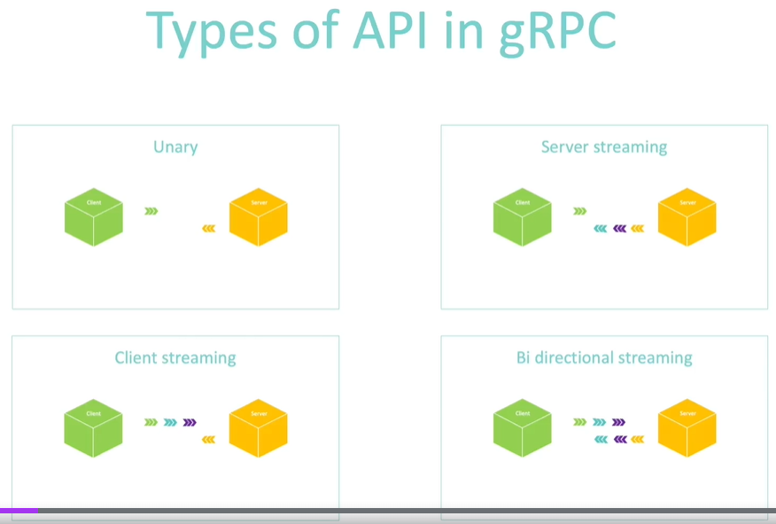
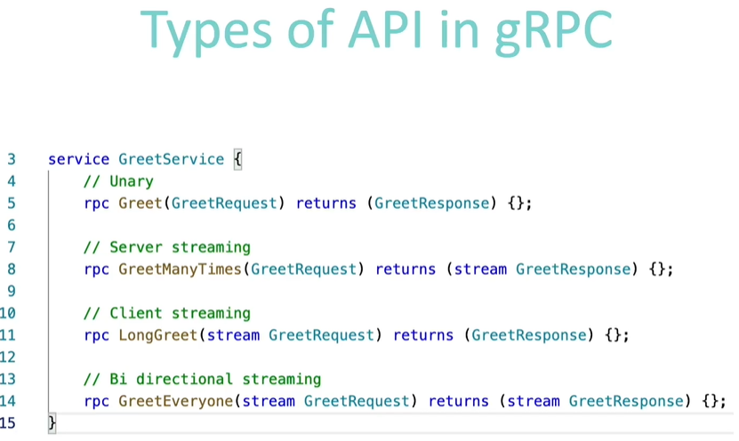
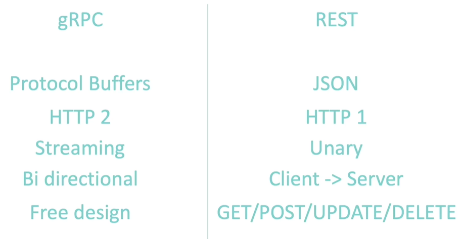

# GRPC
- Efficiency over Json
JSON: 52 bytes (compressed)
```json
{
  "age": 26,
  "first_name": "Clement",
  "last_name": "JEAN"
}
```
Same in Protocol Buffers: 17 bytes
```protobuf
syntax = "proto3";

message Person {
  uint32 age = 1;
  string first_name = 2;
  string last_name = 3;
}
```
JSON format is very CPU intensive mostly due to its human-readable format.
Protocol Buffers format is binary thou it's less CPU intensive, so the communication is faster and more efficient.
That is the reason why GPRC uses Protocol Buffers.

Summary:
- Intuitive Message Definition
- Generated code (support multiple languages)
- Efficient Serialization/Deserialization due to binary format of communication

gRPC relies on HTTP 2
Performance difference between HTTP2 and HTTP1.1 -https://imagekit.io/demo/http2-vs-http1

HTTP 1 
- TCP connection per request
- Plaintext headers (bigger latency per each call)
- Accepts only Request/Response pattern

As an example client needs CSS file, images and js code. To get this info 3 separate requests will be sent with open/close connection for each of the request

HTTP 2
- Provides long-lasting TCP Connection which will be shared by multiple requests and multiple response.
- Support Server push and that means that the server can push multiple messages rom one request from the client and the client doesn't need to ask for more data.
It can just wait for the server to push the data directly when the data is ready.
That's amazing because now we can also avoid a few requests and thus create less chatter.
- Support Multiplexing and that means that the server and the client can push multiple messages in parallel over the same TCP connection
- Requests/Response and headers a compressed into binary data
- SSL connection is required by default

For previous example with HTTP 2 we can ask server for all 3 files in one TCP connection



